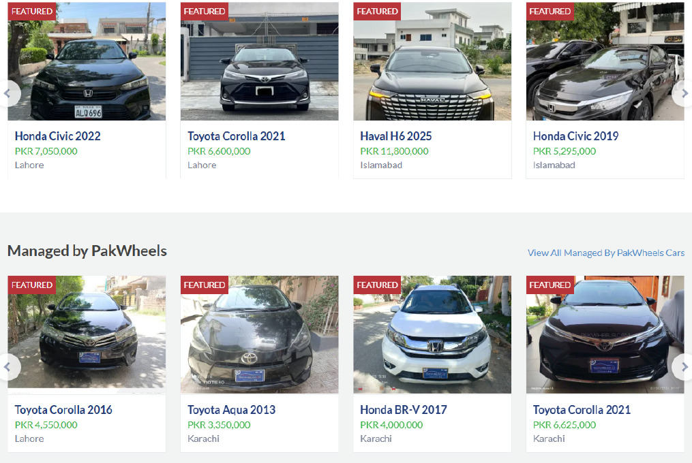
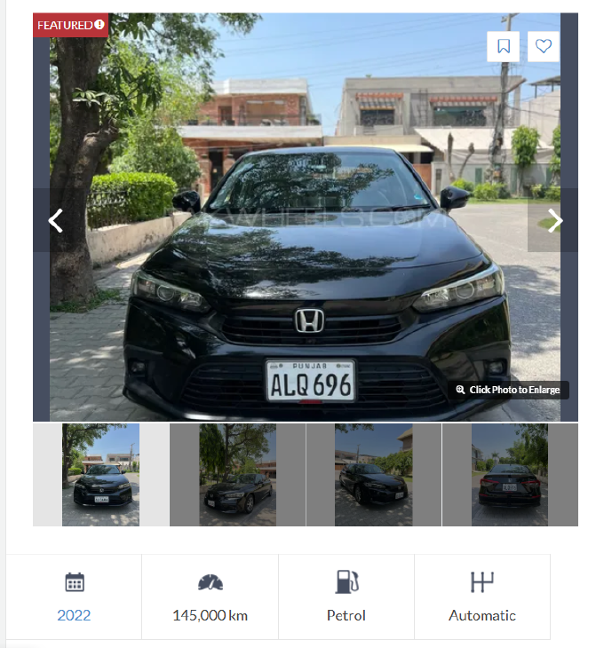
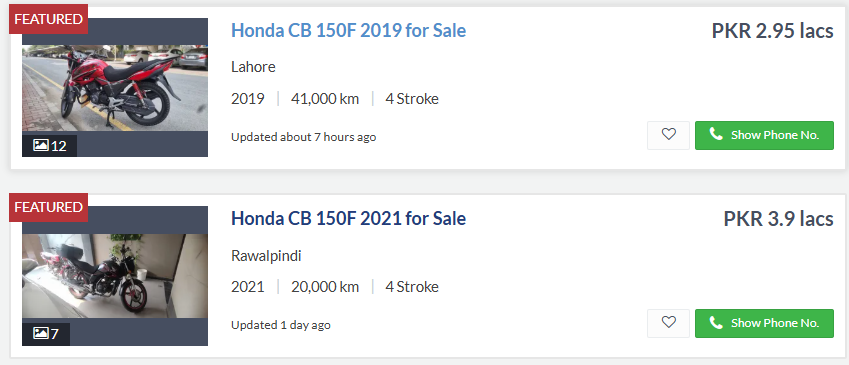
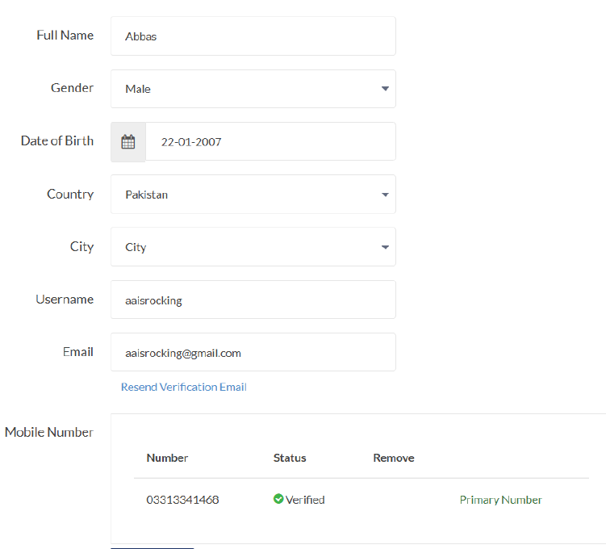
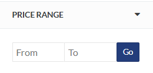
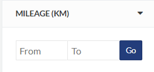
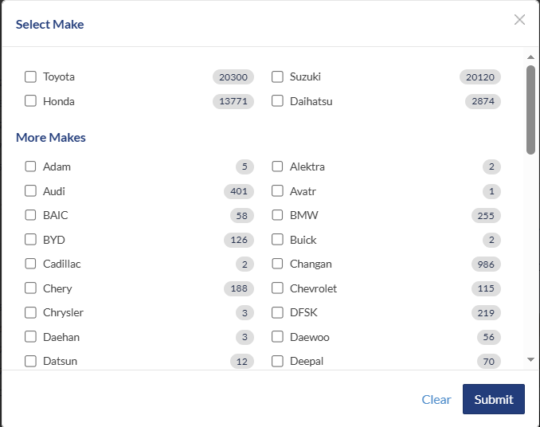

# Car Management System

**Student Name:** Abbas Ali Haider  
**Roll Number:** 25K-0009  
**Class:** BAI-2C

---

## Table of Contents

1. Vehicle Listing
2. Car Ads
3. Bike Ads
4. Buyer Accounts
5. Filter by Price
6. Filter by Year
7. Filter by Mileage
8. Filter by Brand
9. Compare Vehicles

---

## Vehicle Listing

The Vehicle Listing module tell about all Vehicles listed op the Management System with it's details. 

### Screenshot



### Code

```cpp
class Listing : public Printable {
    static int totalListings;
    static const float fee;
    string listingID;
    Vehicle* vehicle;
    long long price;
    string status;
    string datePosted;
    string sellerID;
    friend class CarComparator;
    friend class Admin;
public:
    Listing(string id, Vehicle* v, long long p, string date, string seller) {
        listingID = id;
        vehicle = v;
        price = p;
        datePosted = date;
        sellerID = seller;
        status = "Pending";
        totalListings++;
    }
    ~Listing() { totalListings--; }
```

---

## Car Ads

The car ads section displays all car listed. Including all there details(price,mileage,engine,color,and etc).

### Screenshot 2 - Car Ads



### Code

```cpp
class Car : public Vehicle {
private:
    string bodyType;
    bool hasAC;
    string regNumber;
public:
    Car(string b, string m, int y, float mil, string col, Engine eng, Location loc,
        string bt, bool ac, string reg) : Vehicle(b, m, y, mil, col, eng, loc) {
        bodyType = bt;
        hasAC = ac;
        regNumber = reg;
    }

    string getRegNumber() const {
        return regNumber;
    }
    bool getHasAC() const {
        return hasAC;
    }

    void displayInfo() const {
        cout << year << " " << brand << " " << model << " " << color << endl;
        cout << "Mileage: " << mileage << " km Type: " << bodyType << endl;
        cout << "AC: ";
    }
```

---

## Bike Ads

The bike ads section displays all bikes listed. It also displays the details regarding that bike includig price,mileage,engine cc, and much more. In code, getters are also created
to make sure that other classes can access the private members.

### Screenshot



### Code

```cpp
class Bike : public Vehicle {
private:
    string bikeType;
    int engineCC;
public:
    Bike(string b, string m, int y, float mil, string col, Engine eng, Location loc,
         string bt, int cc)
        : Vehicle(b, m, y, mil, col, eng, loc) {
        bikeType = bt; engineCC = cc;
    }
    string getBikeType() const {
        return bikeType;
    }
    int getEngineCC() const {
        return engineCC;
    }

    void displayInfo() const {
        cout << year << " " << brand << " " << model << " " << color << endl;
        cout << "Mileage: " << mileage << " km Type: " << bikeType << " CC: " << engineCC << endl;
        cout << "Engine: "; engine.print();
        cout << "Location: " << location.getArea() << ", " << location.getCity() << endl;
    }
};
```

---

## Buyer Accounts

The buyer class shows all the details about the buyer including Name, Email and Phone Number. The code snippet also shows the details about vehicles which buyer has saved,
messages he has sent and received.

### Screenshot - Buyer Profile



### Code 1 - Buyer Class

```cpp
class Buyer : public Person {
private:
    Favorite* favorites[50];
    int favCount;
public:
    long long budget;
    string preferredCity;

    Buyer(string id, string n, string e, string ph, string pass) : Person(id, n, e, ph, pass) {
        favCount = 0; budget = 0; preferredCity = "Any";
    }
    void saveListing(Listing* l, string date) {
        if (favCount < 50) {
            favorites[favCount] = new Favorite(l, personID, date);
            favCount++;
        }
    }
    void showSaved() const {
        cout << name << "'s saved listings:" << endl;
        for (int i = 0; i < favCount; i++) {
            if (favorites[i]->savedListing != nullptr) {
                favorites[i]->savedListing->displayInfo();
            }
        }
    }
    void sendMessage(Seller& seller, string content) {
        Message* msg = new Message(personID, seller.getPersonID(), content);
        seller.receiveMessage(msg);
        cout << name << " messaged " << seller.getName() << endl;
    }
    string getRole() const {
        return "Buyer";
    }
};
```

### Code 2 - Buyer Object Creation

```cpp
Buyer buyer1("B1", "Shaheer", "shaheer@gmail.com", "03215566778", "shaheer456");
```

---

## Filter by Price

This feature allows users to filter vehicle according to the price they want.

### Screenshot



### Code

```cpp
void filterByPrice(long long minP, long long maxP) {
    cout << "\nListings between PKR " << minP << " - " << maxP << ":" << endl;
    bool found = false;
    for (int i = 0; i < listingCount; i++) {
        if (listings[i]->isAvailable()) {
            if (listings[i]->inPriceRange(minP, maxP)) {
                listings[i]->displayInfo();
                found = true;
            }
        }
    }
    if (!found) {
        cout << "Nothing in this range." << endl;
    }
}
```

---

## Filter by Year

Users can filter according to the year of car.

### Screenshot


### Code

```cpp
void filterByYear(int old, int New) {
    cout << "\nListings from " << old << " to " << New << ":" << endl;
    bool found = false;
    for (int i = 0; i < listingCount; i++) {
        if (listings[i]->isAvailable() && listings[i]->getVehicle() != nullptr) {
            int y = listings[i]->getVehicle()->getYear();
            if (y >= old && y <= New) {
                listings[i]->displayInfo();
                found = true;
            }
        }
    }
    if (!found) {
        cout << "Nothing found." << endl;
    }
}
```

---

## Filter by Mileage

Users can filter out the vehicles according to the mileage of the car.

### Screenshot



### Code

```cpp
void filterByMileage(float maxMil) const {
    cout << "\nListings under " << maxMil << " km:" << endl;
    bool found = false;
    for (int i = 0; i < listingCount; i++) {
        if (listings[i]->isAvailable() && listings[i]->getVehicle() != nullptr) {
            if (listings[i]->getVehicle()->getMileage() <= maxMil) {
                listings[i]->displayInfo();
                found = true;
            }
        }
    }
    if (!found) {
        cout << "Nothing found." << endl;
    }
};
```

---

## Filter by Brand

Users can search and filter vehicles according to the Brand. Makes searching for User easy as he will not be going to scroll throught all the listed vehicles.

### Screenshot



### Code

```cpp
void searchByBrand(string brand) {
    cout << "\nSearch results for " << brand << ":" << endl;
    bool found = false;
    for (int i = 0; i < listingCount; i++) {
        if (listings[i]->isAvailable() && listings[i]->getVehicle() != nullptr) {
            if (listings[i]->getVehicle()->matchesBrand(brand)) {
                listings[i]->displayInfo();
                found = true;
            }
        }
    }
    if (!found) {
        cout << "Nothing found." << endl;
    }
}
```

---

## Compare Vehicles

This class lets Users compare two cars, where there Price, Mileage, Model and other details are displayed.
It makes easier for user to choose between two cars, and according to his budget.

### Screenshot


### Code

```cpp
class CarComparator {
public:
    CmpResult compare(Listing* L1, Listing* L2) {
        CmpResult result;
        Vehicle* v1 = L1->vehicle;
        Vehicle* v2 = L2->vehicle;

        cout << "\nComparing Cars" << endl;
        cout << "Brand: " << v1->getBrand() << " - " << v2->getBrand() << endl;
        cout << "Model: " << v1->getModel() << " - " << v2->getModel() << endl;
        cout << "Price: " << L1->price << " - " << L2->price << endl;
        cout << "Mileage: " << v1->getMileage() << " - " << v2->getMileage() << endl;

        if (L1->price < L2->price) {
            result.car1Wins++; }
        else if (L2->price < L1->price) {
            result.car2Wins++; }
        else {
            result.ties++; }

        if (v1->getMileage() < v2->getMileage()) {
            result.car1Wins++; }
        else if (v2->getMileage() < v1->getMileage()) {
            result.car2Wins++; }
        else {
            result.ties++; }

        double lowerPrice;
        if (L1->price < L2->price){
            lowerPrice = L1->price;
        }
        else{
            lowerPrice = L2->price;
        }
        float lowerMil;
        if (v1->getMileage() < v2->getMileage()){
            lowerMil = v1->getMileage();
        }
        else{
            lowerMil = v2->getMileage();
        }
        cout << "Better Price: " << lowerPrice << endl;
        cout << "Lower Mileage: " << lowerMil << " km" << endl;

        return result;
    }
};
```
---
## UML Diagram ##
---
This is UML Diagram made on Draw.io, and the proof has been uploaded in images folder.
---

.drawio.png)


---
---
